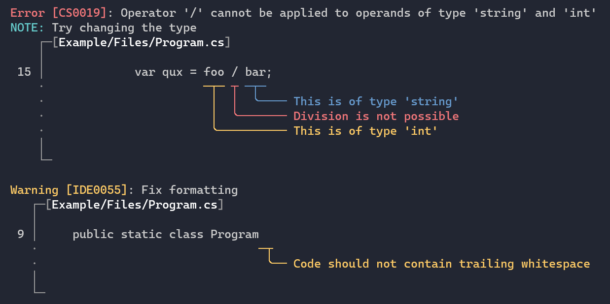

# Errata

A library that makes it easy to create and display diagnostics of
different kinds.



## Running examples

To see `Errata` in action, install the 
[dotnet-example](https://github.com/patriksvensson/dotnet-example)
global tool.

```
> dotnet tool install -g dotnet-example
```

Now you can list available examples in this repository:

```
> dotnet example
```

## Building

We're using [Cake](https://github.com/cake-build/cake) as a 
[dotnet tool](https://docs.microsoft.com/en-us/dotnet/core/tools/global-tools) 
for building. So make sure that you've restored Cake by running 
the following in the repository root:

```
> dotnet tool restore
```

After that, running the build is as easy as writing:

```
> dotnet cake
```